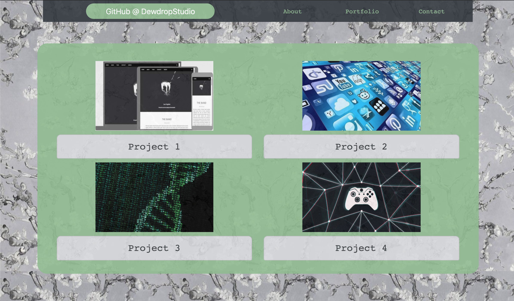
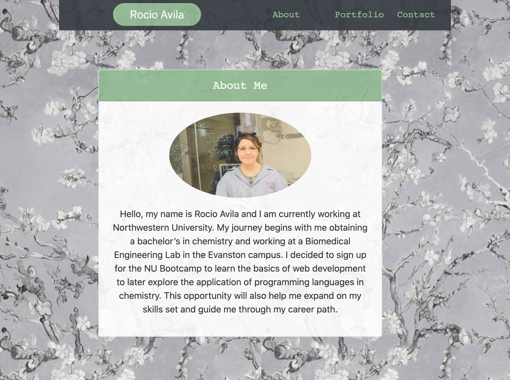
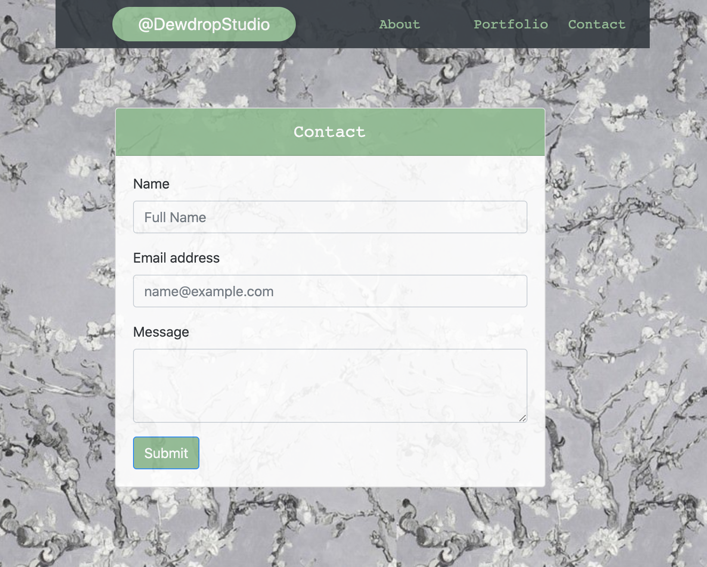

# Portfolio

I decided to showcase my Portfolio first, as a personal preference and included an about.html and contact.html instead. 
As for the design, I ended up experimenting with different backgrounds and Bootstrap code. CSS file style.css corresponds
to all the HTML files, index.html, about.html, and contact.html. 

Content is also resposive to mobile screens. 